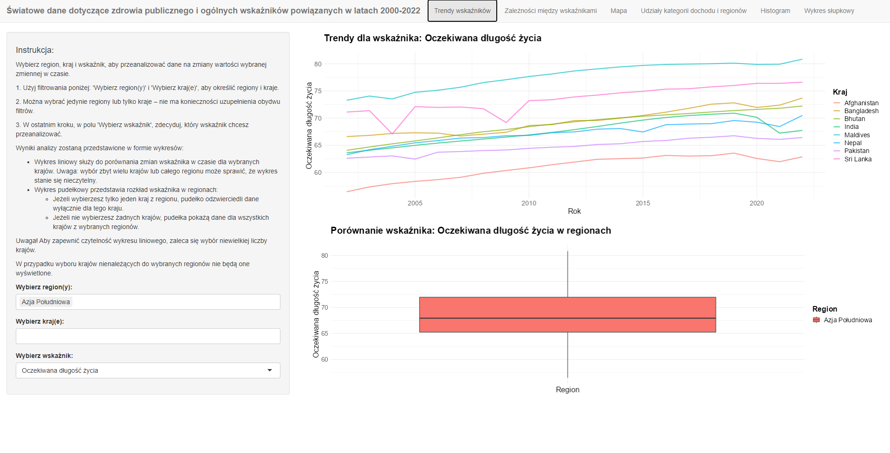
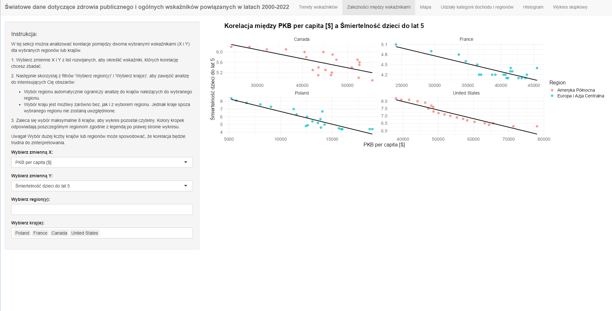
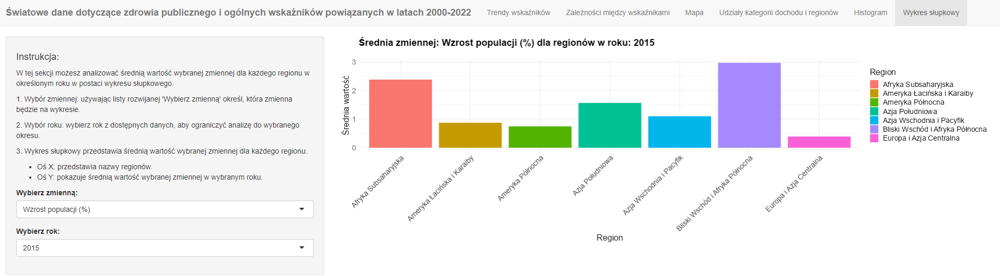

# Public Health & Economic Indicators Dashboard in RShiny

## Overview

This project is an interactive dashboard created using **R Shiny** to analyze global public health and economic data (2000-2022). It visualizes key indicators such as life expectancy, health expenditure, GDP, and more, using data obtained from the **World Bank API** via the **WDI** package.

The dashboard allows users to explore trends, correlations, and regional distributions of selected indicators.

### Tools & Technologies used:
- **R** for data analysis and visualization.
- **R Shiny** for interactive dashboard.
- **WDI package** to access World Bank data via the API.

### Dashboard Overview 
*The dashboard displays global trends in health and economic indicators. Below you can find selected views with examples and descriptions.*

---

### **Section 1: Trend Analysis for Life Expectancy**
This section visualizes **life expectancy trends** from 2000 to 2022. Users can select a region and specific countries to see how life expectancy has evolved over time. The line chart shows trends for each country, while the box plot adjusts to display life expectancy distribution for the selected region based on chosen countries.

  

---

### **Section 2: Correlation Between GDP per Capita and Under-5 Mortality Rate**
This section visualizes the **correlation between GDP per capita** and **under-5 mortality rate**. Users can select countries and regions to analyze how these two indicators relate. The scatter plot shows the correlation for each country, with the regression line illustrating the trend. The selected regions are differentiated by color to show data points from different areas.

#### Key Features:
- **Scatter Plot**: Displays the relationship between GDP per capita and under-5 mortality rate for selected countries.
- **Regression Line**: Helps visualize the trend and strength of the correlation.
- **Interactive Filters**: Choose different regions (North America, Central and Eastern Europe) and countries for analysis.

  

---

### **Section 3: Population Growth Comparison by Region (2015)**
This section visualizes the **average population growth rate** for different regions in 2015. The **bar chart** displays the growth percentages for each region, providing an easy comparison between them. The user can select a different year to view the corresponding data for that period.

  

---

## Project stages and outcomes

- **Data preparation:** Data is fetched from the **World Bank API**, cleaned, and processed for analysis.
- **Interactive dashboard:** Allows exploration of health and economic trends, correlations, and regional comparisons.
- **Visualization tools:** Includes line charts, scatter plots, maps, histograms, and pie charts for in-depth data analysis.

---

## Notes

- **Report Language:** The report and code comments are written in Polish.

